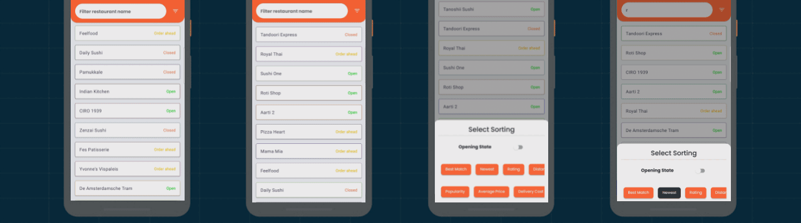
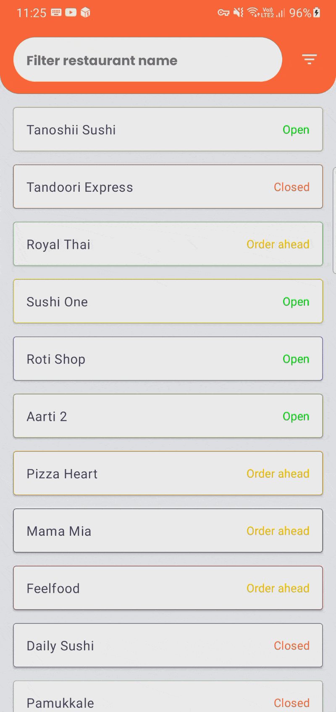
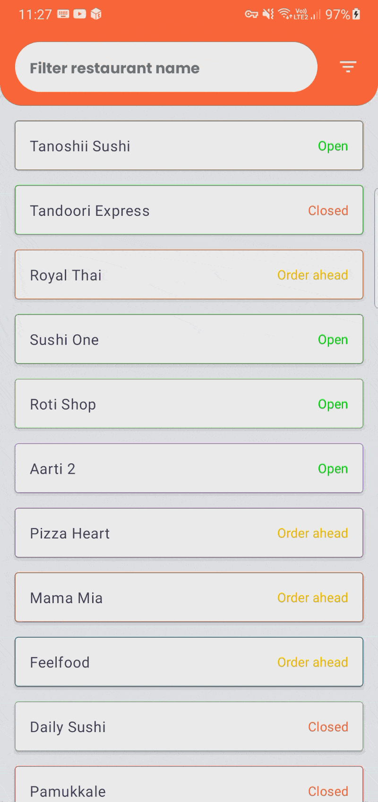

# Restaurants - Jetpack Compose

An example concepts of MVVM and Kotlin. Display, Filter & Sort the given restaurants from assets with Jetpack Compose and AAC.

## The Goal
Visualize a restaurant list with filtering based on name and sorting value to sort the list.

### Features 🔥
- Demo is memory leak-free (leakCanary).
- UseCase / Repository / DataSource logics are best practises from clean architecture.
- Long-running operations(sorting in extensive lists) are calculated in IO Dispatcher.
- Furthermore, good applications deserves good logging mechanism,so Timber added.
- Android Architecture Components
- Code quality, readability and consistent code style (Detekt).
- Multi-module architecture
- Jetpack Compose with Navigation
- Kotlin Flow
- Multiple Data Sources
- Unit test (JUnit)
- Instrumentation Test(Compose)
- Both vertical / portrait support
- Context-configuration changes retain outgoing requests.

      

## Contribution 👏
Please feel free to open issues or pull requests; all sorts of contributions are welcome! I kindly value your contribution! Let's get started ✌️

## Contributors 👑
* [boranfrkn](https://github.com/boranfrkn)

## Contact
* Linkedin: https://www.linkedin.com/in/mbakgun/

License
-----------------

    Copyright 2021 Mehmet Burak Akgün

    Licensed under the Apache License, Version 2.0 (the "License");
    you may not use this file except in compliance with the License.
    You may obtain a copy of the License at

    http://www.apache.org/licenses/LICENSE-2.0

    Unless required by applicable law or agreed to in writing, software
    distributed under the License is distributed on an "AS IS" BASIS,
    WITHOUT WARRANTIES OR CONDITIONS OF ANY KIND, either express or implied.
    See the License for the specific language governing permissions and
    limitations under the License.